# FreeLine

**A free U.S. phone number in your pocket.** FreeLine is a mobile-first VoIP app that gives users a real U.S. phone number for calling and texting over Wi-Fi or mobile data -- no carrier plan required.

The core thesis: phone numbers should feel as free and easy to get as email addresses.

---

## iOS

<p align="center">
  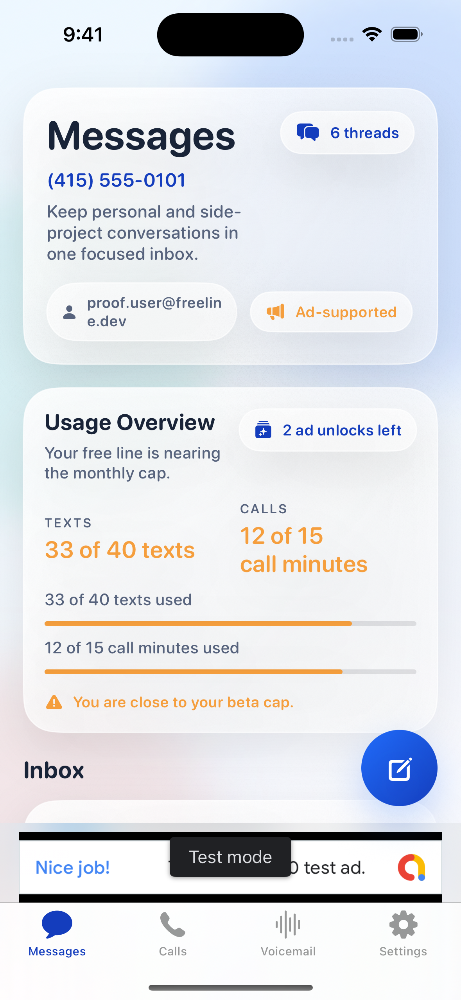
  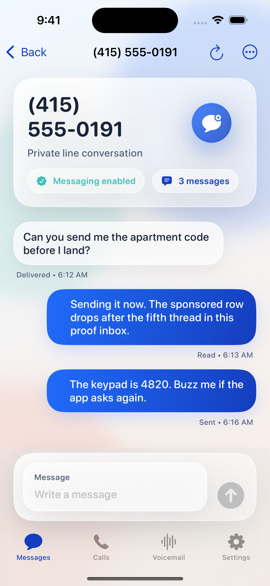
  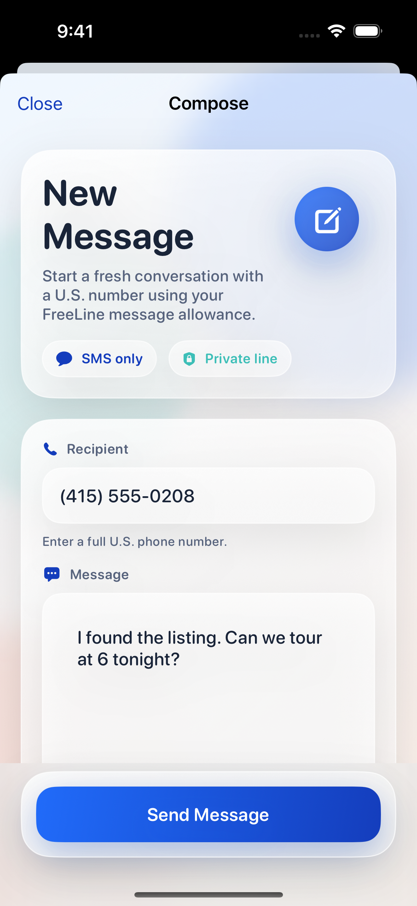
  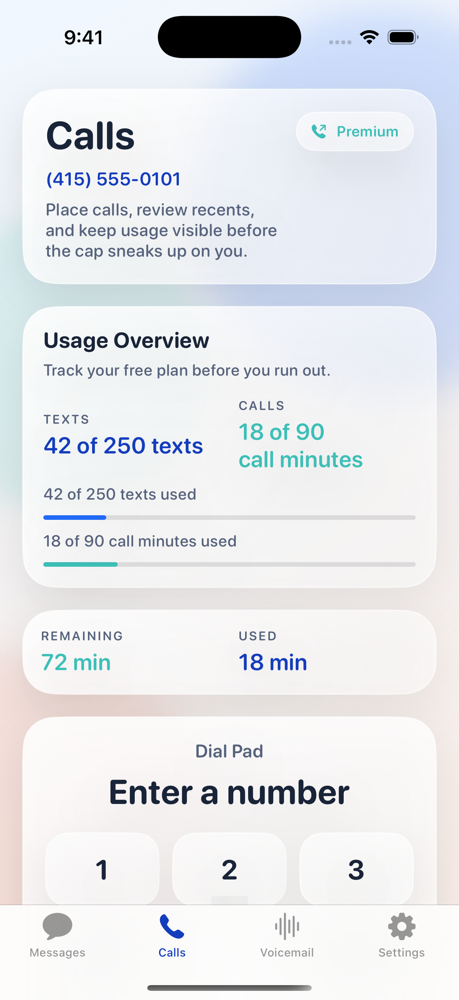
</p>

<p align="center">
  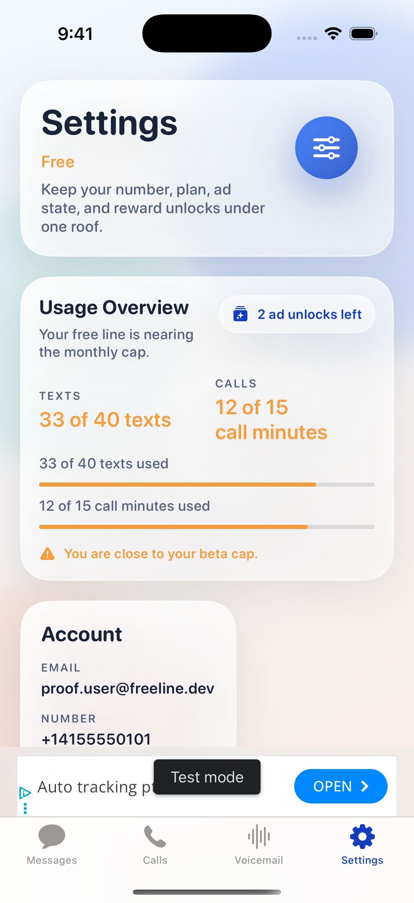
  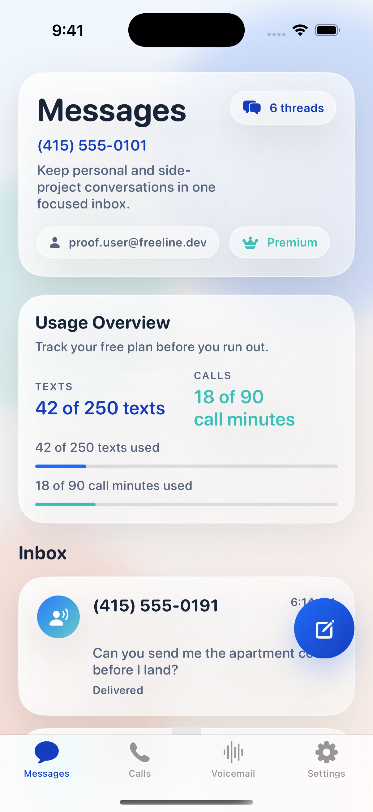
  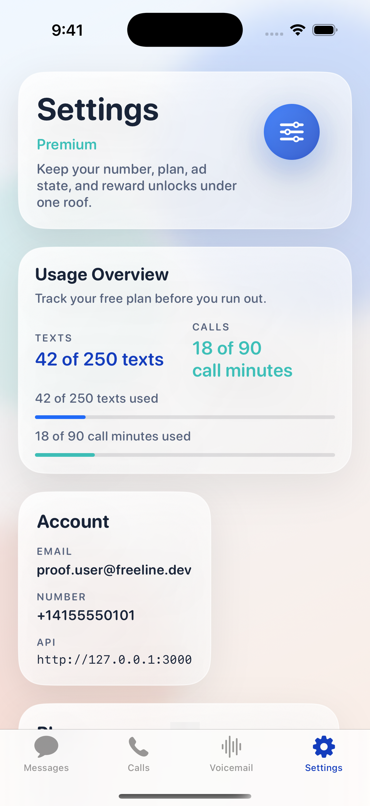
  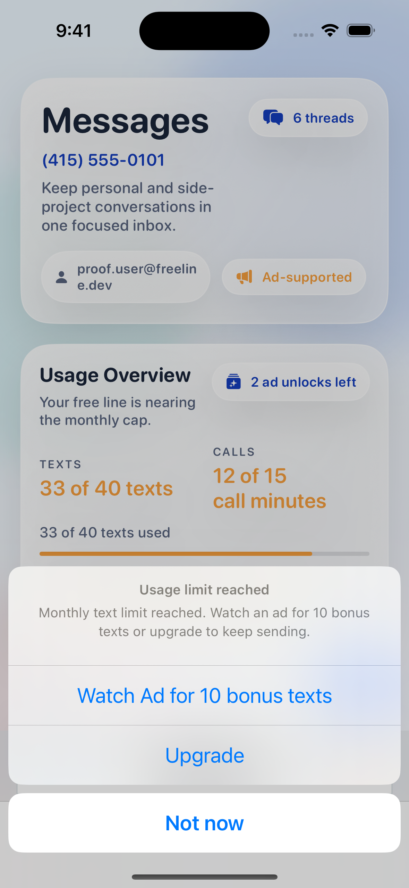
</p>

## Android

<p align="center">
  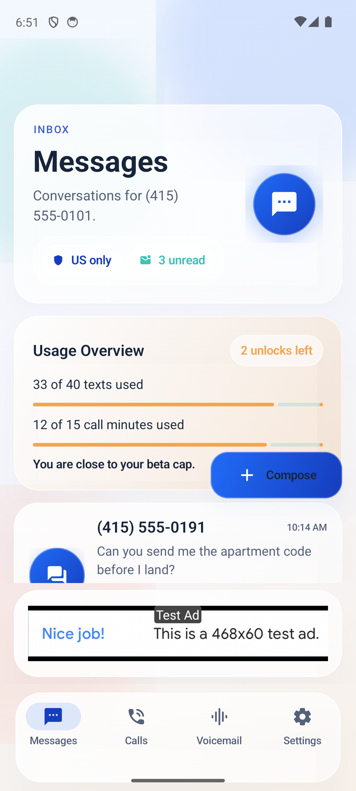
  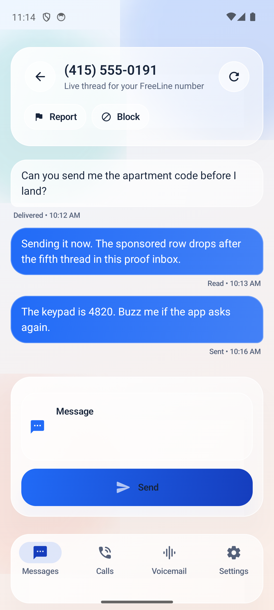
  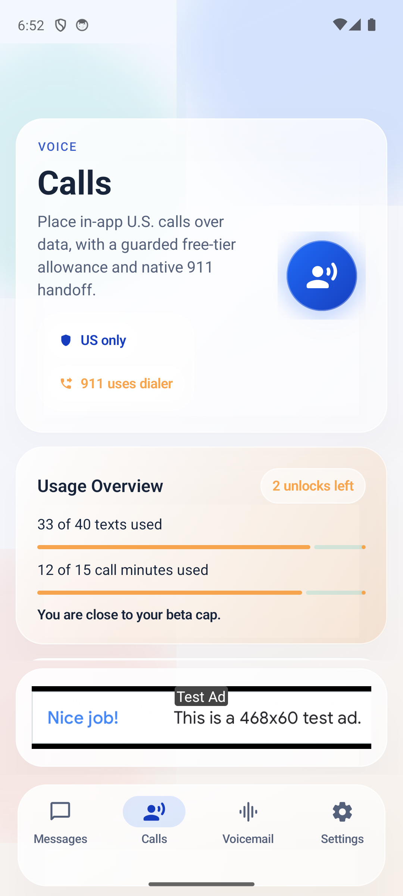
  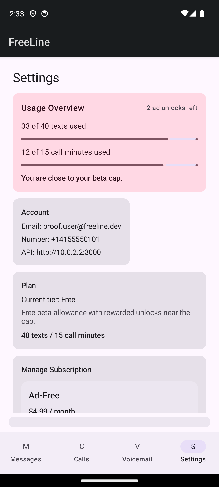
</p>

---

## What It Does

I built FreeLine as a learning exercise to deeply understand the TextNow product model -- the telephony layer, the unit economics, the abuse controls, and what it takes to offer a free phone number sustainably. Users download the app, sign up, choose a U.S. area code, and claim a free phone number. From there they can send and receive SMS, make and receive voice calls, and access voicemail -- all from inside the app over any internet connection.

### User Flow

1. **Download** the app on iOS or Android
2. **Sign up** with email, Apple Sign-In, or Google Sign-In
3. **Choose** a U.S. area code
4. **Claim** a free phone number
5. **Call and text** from inside the app

### Key Features

| Feature | Details |
|---|---|
| **Free U.S. Number** | One real phone number per user, selected by area code |
| **SMS Messaging** | Send and receive 1:1 text messages with delivery status |
| **Voice Calling** | Outbound and inbound calls with native call UI (CallKit on iOS, ConnectionService on Android) |
| **Voicemail** | Missed calls go to voicemail with in-app playback |
| **Push Notifications** | Real-time alerts for incoming messages and calls, even when the app is backgrounded |
| **Usage Dashboard** | Live tracking of texts sent and call minutes used against monthly caps |
| **Rewarded Unlocks** | Watch an ad to earn bonus texts or call minutes when approaching the cap |
| **Subscription Tiers** | Free (ad-supported), Ad-Free ($4.99/mo), Premium ($9.99/mo) with higher limits |
| **Report & Block** | Per-conversation reporting and blocking for spam/abuse |

---

## How It Works

### Architecture

FreeLine is a three-tier system: native mobile clients, a backend API, and telephony providers.

```
iOS App (SwiftUI)  ──┐
                     ├──▶  Backend API (Fastify + TypeScript)
Android App (Compose)┘          │
                                ├──▶ PostgreSQL (users, messages, calls, numbers)
                                ├──▶ Redis (rate limits, caching, sessions)
                                ├──▶ Bandwidth / Twilio (telephony)
                                ├──▶ APNs / FCM (push notifications)
                                ├──▶ RevenueCat (subscriptions)
                                └──▶ AdMob (ads)
```

### Telephony Layer

All telecom operations are behind a `TelephonyProvider` interface, allowing the backend to swap between providers without changing application logic.

- **Primary provider:** Bandwidth -- owns its own Tier 1 network, ~50% cheaper than Twilio at scale
- **Fallback provider:** Twilio -- more polished developer experience, used as contingency
- **Dev provider:** Stub -- deterministic responses for safe local testing

The provider handles number search/provisioning, SMS send/receive, voice token generation, and inbound call routing.

### Voice Calling Flow

FreeLine uses VoIP, not the device's cellular radio. Inbound calls work even when the app is in the background:

- **iOS:** PushKit delivers a silent wake notification, CallKit presents the native incoming call screen
- **Android:** FCM high-priority data message wakes the app, ConnectionService presents the native call UI

Outbound calls are placed through the Twilio Voice SDK with access tokens generated server-side.

### SMS Flow

```
User sends message ──▶ Backend validates (rate limits, policy, caps)
                       ──▶ Bandwidth/Twilio sends SMS to PSTN
                       ──▶ Webhook confirms delivery status
                       ──▶ App updates with "Delivered" / "Read"

Recipient replies  ──▶ Bandwidth/Twilio webhook hits backend
                       ──▶ Backend stores message, resolves conversation
                       ──▶ Push notification sent to user's device
                       ──▶ Real-time WebSocket update to active app
```

### Monetization Model

FreeLine follows the proven TextNow formula: free tier subsidized by ads, with paid upgrades for power users.

| Tier | Price | Texts/mo | Call Minutes/mo | Ads |
|---|---|---|---|---|
| **Free** | $0 | 40 (up to 80 with rewarded ads) | 15 (up to 35 with rewarded ads) | Banner, interstitial, rewarded |
| **Ad-Free** | $4.99/mo | 40 | 15 | None |
| **Premium** | $9.99/mo | 250 | 90 | None |

Ad placements are non-intrusive: banners in the inbox, interstitials at natural transition points (after ending a call), and opt-in rewarded videos to earn bonus usage. Ads never interrupt active conversations or calls.

### Abuse Controls & Cost Management

Unit economics are the make-or-break constraint for a free telephony product. FreeLine enforces:

- **Usage caps** -- daily and monthly limits on texts and call minutes per user
- **Rate limiting** -- per-user and global rate limits on outbound traffic
- **Inactivity reclaim** -- free numbers are recycled after 14 days of inactivity (warnings at day 10 and 13)
- **Number quarantine** -- released numbers sit in quarantine for 45 days before reassignment
- **Trust scoring** -- new accounts start with conservative limits that relax over time
- **First-7-day caps** -- 10 outbound texts/day, 5 unique contacts/day, 10 call minutes/day
- **A2P 10DLC compliance** -- registered as application-to-person messaging for carrier compliance

### Number Lifecycle

```
User claims number ──▶ 24h activation window (must send/receive a real message or call)
                       ──▶ Active: number stays assigned while account is used
                       ──▶ Inactive 10 days: warning notification
                       ──▶ Inactive 13 days: final warning
                       ──▶ Inactive 14 days: number reclaimed
                       ──▶ Quarantine (45 days): number cannot be reassigned
                       ──▶ Available: number re-enters inventory
```

---

## Tech Stack

| Layer | Technology |
|---|---|
| **iOS** | SwiftUI, PushKit, CallKit, Twilio Voice SDK, AdMob SDK, RevenueCat |
| **Android** | Kotlin, Jetpack Compose, ConnectionService, FCM, Twilio Voice SDK, AdMob SDK, RevenueCat |
| **Backend** | TypeScript, Fastify, Node.js 18+ |
| **Database** | PostgreSQL |
| **Cache** | Redis |
| **Telephony** | Bandwidth (primary), Twilio (fallback) |
| **Subscriptions** | RevenueCat |
| **Ads** | Google AdMob |
| **Auth** | JWT, OAuth 2.0 (Apple, Google) |

## Repo Structure

```
FreeLine/
  FreeLine-iOS/          SwiftUI iOS app
  FreeLine-Android/      Kotlin + Jetpack Compose Android app
  FreeLine-Backend/      TypeScript API server
  phases/                Feature phase specs and verification artifacts
  docs/                  Privacy policy, terms of service, support
  scripts/               Verification and automation
```

## API Surface

```
Auth:       POST /v1/auth/email/start, /verify, /oauth/apple, /oauth/google, /refresh
Numbers:    GET  /v1/numbers/search?areaCode=..., POST /claim, GET /me, POST /release
Messaging:  GET  /v1/conversations, GET /:id/messages, POST /v1/messages
Calls:      POST /v1/calls/token, GET /history, GET /voicemails
Controls:   POST /v1/blocks, POST /v1/reports
Webhooks:   POST /v1/webhooks/telecom/messages/inbound, /status, /calls/inbound, /status
```

---

## Cost Model

FreeLine is designed as a subsidized communications product, not a carrier plan. Every architectural decision is informed by per-user unit economics.

| Metric | Target |
|---|---|
| Telecom cost per active user | < $1.50/mo (Bandwidth) |
| Ad ARPU per active user | > $1.00/mo |
| Freemium conversion rate | > 3% |
| Idle number percentage | < 10% of provisioned |

At **10,000 active users**, the app is projected to generate **$3,000 - $8,000/month** in gross margin.

---

## Why I Built This

I built FreeLine to demonstrate that I understand the TextNow product from the inside out -- not just the user-facing features, but the underlying economics, infrastructure, and operational challenges that make a free telephony product work.

This project covers:

1. **Telephony provider integration** -- Bandwidth as primary, Twilio as fallback, behind a swappable `TelephonyProvider` interface
2. **Unit economics modeling** -- per-user cost tracking, usage caps, and the math behind subsidizing free numbers with ads and paid upgrades
3. **Abuse and cost controls** -- rate limiting, trust scoring, number recycling, and quarantine policies built into the foundation
4. **Native mobile development** -- separate SwiftUI (iOS) and Jetpack Compose (Android) codebases with platform-native call handling (PushKit/CallKit, FCM/ConnectionService)
5. **Monetization architecture** -- AdMob integration, RevenueCat subscriptions, and rewarded ad unlocks as the bridge between free and paid tiers

The full product -- auth, number claiming, SMS, voice, voicemail, ads, subscriptions, abuse controls, admin ops, and number lifecycle management -- is implemented across **11 execution phases**, each with automated verification and proof artifacts for both platforms.
